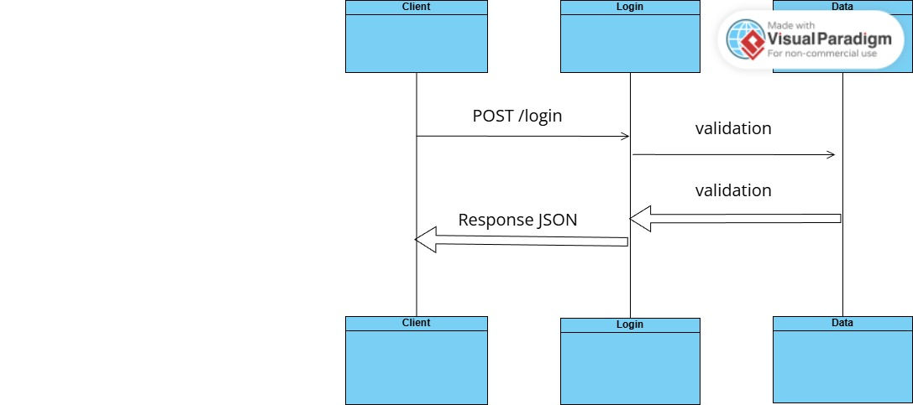

Microservice #3: Login Microservice

As a user, I want to be able to login to my account, so that I can have my own personal collection of data

## 1. How to Programmatically REQUEST Data

- **Method:** REST API `POST`  
- **Data:** `JSON`
- **Base URL:** `HTTP`

```text
http://localhost:5000

```
### Example for REQUESTING 

- 1. SEND POST TO `"/login"` WITH BODY:
     "username":{
     password:"password}

```json
 {
  "abc123":{
  password:"def1234"}
}
```
## 2. How to Programmatically RECEIVE Data
If the login microservice receives a valid JSON object, it will return one of the following responses:

- status 400, message: "Please enter your username and password", when username or password are not given
- status 401, message: "Invalid username or password", when username or password are incorrect
- message: "Login successful", when username or password matches a corresponding entry in the database.

### Example for RECEIVING
- REQUEST WAS SENT TO "Login"

- WAIT FOR RESPONSE

```text
IF response received:
    READ DATA TYPE = JSON
        DISPLAY:{
          message: "Login successful"
          }
```
### Example JSON object 
```json
{
  message: "Login successful"
}
```
## Installation & Running the Microservice
-  Install Express

Open your terminal inside the project folder and run:
```text
npm install express
```

-  Start the Microservice
Once Express is installed, start the frontend of your web app with:
```text
npm start
```

start the backend of the web app (server.js) with:
```test
node server.js
```

- If everything is working, you will see:
```text
Server running on http://localhost:5000
```
### Working Example URLs
You can test this microservice directly in your browser using these URLs once you have it running:

Login page as the root of the web app
http://localhost:5000/

Login page as one of the pages in web app
http://localhost:5000/login

- Run on new terminal: 
```text
node server.js
```

## 3. UML Sequence Diagram – Search Microservice

